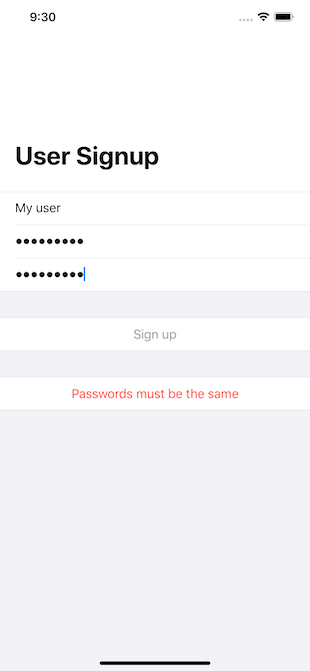

# SwiftUI Signin

Basic SwiftUI app for collecting user info for signup and validating its acceptability before enabling the Signup button. It creates a UserInfo class that uses Combine's CombineLatest function to provide a clean easy way to validate the input. Using Combine and a separate class removes validation code from the page view. Much nicer code.

|

## License

SignInSwiftUI is licensed under the MIT License. See the LICENSE file for more information, but basically this is sample code and you can do whatever you want with it.